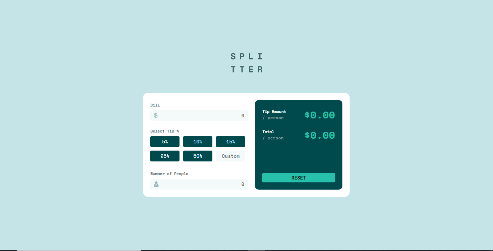

# Frontend Mentor - Tip calculator app solution

This is a solution to the [Tip calculator app challenge on Frontend Mentor](https://www.frontendmentor.io/challenges/tip-calculator-app-ugJNGbJUX). Frontend Mentor challenges help you improve your coding skills by building realistic projects.

## Table of contents

- [Overview](#overview)
  - [The challenge](#the-challenge)
  - [Screenshot](#screenshot)
  - [Links](#links)
- [My process](#my-process)
  - [Built with](#built-with)
  - [What I learned](#what-i-learned)
  - [Continued development](#continued-development)
- [Author](#author)


## Overview

### The challenge

Users should be able to:

- View the optimal layout for the app depending on their device's screen size
- See hover states for all interactive elements on the page
- Calculate the correct tip and total cost of the bill per person

### Screenshot




### Links

- Solution URL: [Tip calculator Github Repo]()
- Live Site URL: [Tip calculator](https://tip-calculator.oluwafemi21.repl.co/?bill=&people=)

## My process

### Built with

- Semantic HTML5 markup
- Flexbox
- CSS Grid
- Desktop-first workflow


### What I learned

- I learnt how to use the 'input' event
- How to toggle an active class using Javascript

```html
<div class="grid-tip">
  <button class="btn" value=5>5%</button>
  <button class="btn" value=10>10%</button>
  <button class="btn" value=15>15%</button>
  <button class="btn" value=25>25%</button>
  <button class="btn" value=50>50%</button>
  <input class="btn inverted" type="number" placeholder="Custom" id="custom-btn"/>  
  </div> 
```
```css
.btn.active{
  background-color: var(--Strong-cyan);
  color: black;
  font-weight: 700;
}

```
```js
buttons.forEach(button => {
  button.addEventListener('click', (event) => {
    event.preventDefault();

    // Toggle active button
    buttons.forEach(btn => 
    btn.classList.remove('active'));
    button.classList.add('active');

}
```

### Continued development

- Javascript DOM manipulation

## Author

- Website - [Oluwafemi Olukoya]
- Frontend Mentor - [@Oluwafemi21](https://www.frontendmentor.io/profile/Oluwafemi21)
- Twitter - [@femi_io](https://www.twitter.com/femi_io)


